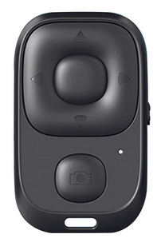

# Beauty-R1 android interceptor


The Beauty-R1 is a bluetooth clicker that I bought thinking
it would emulate a bluetooth keyboard.

[](./beauty.png)

It turns out that it emulates a mouse instead: when you press a button,
it simulates dragging the mouse pointer, not useful for what I need.

Since [I couldn't find a development kit](https://github.com/olivluca/bluetooth-tiktok-remote)
to modify its firmware, I wrote this C program that intercepts the events from the clicker
and injects keypresses.

It's meant to run in an android tablet via adb shell (since it needs 
access to the devices under /dev/input/eventX) and uses the "input keyevent
X" command to inject the keypresses.

I compile it with 

```
arm-linux-gnueabi-gcc --static beauty.c -o beauty
```

then I can push it to the tablet 

```
adb push beauty /data/local/tmp/beauty
```

You can test it via adb shell either running

```
/data/local/tmp/beauty
```

or 

```
/data/local/tmp/beauty debug
```

(this way it will print out all the events received from the clicker).

Since I don't want to keep an adb connection, I wrote an
[Automate](https://llamalab.com/automate/)  macro with
the [ADB shell command](https://llamalab.com/automate/doc/block/adb_shell_command.html) block.
